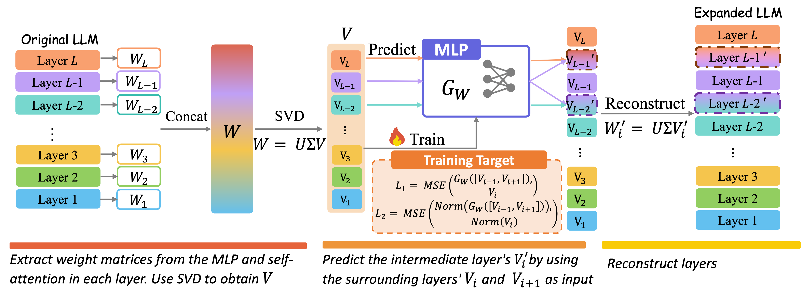

# LESA: Learnable LLM Layer Scaling-Up

Source code for "LESA: Learnable LLM Layer Scaling-Up".

## Recommended software environment
- python == 3.10
- torch == 2.1.2
- transformers >= 4.45.0
- scikit-learn >= 1.0
- tqdm >= 4.49.0
- numpy >= 1.20.2

## Description

- The main implementation of LESA and how to use it to train the $\mathcal{W_G}$, and predict the layers to be inserted is described in `train_LESA.ipynb`.
- How to use the expanded model for evaluation is described in `load_LESA.ipynb`

> [!NOTE]  
> This repo is under construction.